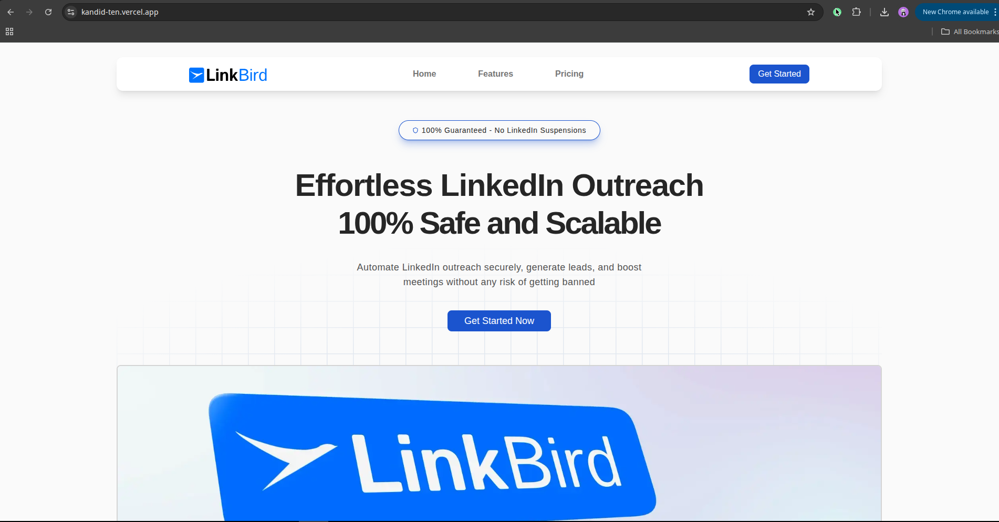

# Kandid Assignment

This is my implementation of the Kandid intern assignment where I replicated key sections of the Linkbird.ai platform using Next.js, Drizzle ORM, and modern web technologies.

## ✅ Demo

[](https://drive.google.com/file/d/1XJfcVSG5cRajL6uSuGIGFrngKTZOEV_w/view?usp=sharing)


## 🚀 Features

- **Authentication**: Email/password and Google OAuth, registration, protected routes.
- **Leads**: Infinite scroll, detail side sheet with smooth animations.
- **Campaigns**: Overview table, each campaign details, progress bars, filters.
- **UI & Navigation**: Collapsible sidebar, breadcrumbs, error handling.

## 🛠 Tech Stack

- Next.js 15+, Tailwind CSS
- Drizzle ORM
- Better Auth (credentials + Google OAuth)
- TanStack Query for data fetching
- Zustand for state management

## 📦 Setup

1. Clone the repo and install dependencies:
   ```bash
   git clone https://github.com/yourusername/kandid.git
   cd kandid
   npm install
   ```

2. Add environment variables in .env.

3. Run the app:
   ```bash
   npm run dev
   ```
## 📂 Structure
Clean architecture with reusable components, state management, and optimized queries.

### Authentication Endpoints

Registers a new user with email and password.
```
POST /api/auth/register
```  
User Login.
```
POST /api/auth/login
```  

To get User details
```
GET /api/auth/user
```

### Leads Endpoints

Fetches all leads with pagination.
```
GET /api/leads
```  

Fetches lead details by ID.
```
GET /api/leads/[id]
```  

### Campaigns Endpoints

Retrieves all campaigns.
```
GET /api/campaign
```  

Retrieves detailed campaign information.
```
GET /api/campaign/[id]
```  

## 📂 Database Schema Documentation

### Users Table
Handled by Better Auth, includes:
- id (UUID)
- email
- password hash
- etc.

### Campaigns Table
Columns:
- id (number, PK)
- campaignName (string)
- status (enum: Draft, Active, Paused, Completed)
- totalLeads (number)
- successfulLeads (number)
- responseRate (real)
- progressBar (real)
- createdAt (timestamp)

### Leads Table
Columns:
- id (number, PK)
- name (string)
- email (string)
- company (string)
- campaignId (FK to Campaigns)
- status (enum: Pending, Contacted, Responded, Converted)
- lastContacted (timestamp)

## 🚀 Deployment Instructions

1. Create a project in Vercel and link it to this GitHub repository.
2. Set the environment variables in Vercel:
    - DATABASE_URL=
    - BETTER_AUTH_SECRET=
    - BETTER_AUTH_URL=
    - GOOGLE_CLIENT_ID=
    - GOOGLE_CLIENT_SECRET=
    - NEXT_PUBLIC_BETTER_AUTH_URL=

3. Run the deployment – Vercel will automatically build and host the app.
4. Verify that authentication works and the app loads at your deployment URL.
